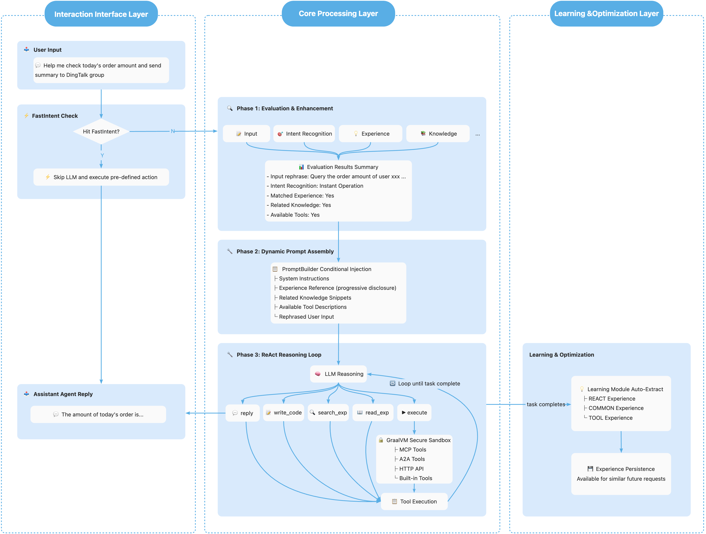

# Assistant Agent

[English](README.md) | [中文](README_zh.md)

[](LICENSE)
[](https://openjdk.org/)
[](https://spring.io/projects/spring-boot)
[](https://spring.io/projects/spring-ai)
[](https://www.graalvm.org/)

## ✨ Technical Features

- 🚀 **Code-as-Action**: Agent generates and executes code to complete tasks, rather than just calling predefined tools
- 🔒 **Secure Sandbox**: AI-generated code runs safely in GraalVM polyglot sandbox with resource isolation
- 📊 **Multi-dimensional Evaluation**: Multi-layer intent recognition through Evaluation Graph, precisely guiding Agent behavior
- 🔄 **Dynamic Prompt Builder**: Dynamically inject runtime context, prefetched experience candidates, and stable guidance into prompts based on scenarios and evaluation results
- 🧠 **Unified Experience System**: Manage COMMON / REACT / TOOL experiences in one model, support conversion to and from the Skills model, and improve experience efficiency and quality through progressive disclosure
- 🗂️ **Management Console**: Provide a dedicated management module for experience search, CRUD, statistics, and SKILL preview / import / export, so reusable experience and skill assets can be maintained in one place
- ⚡ **Fast Response**: For familiar scenarios, skip LLM reasoning process and respond quickly based on experience

## 📖 Introduction

**Assistant Agent** is an enterprise-grade intelligent assistant framework built on [Spring AI Alibaba](https://github.com/alibaba/spring-ai-alibaba), adopting the Code-as-Action paradigm to orchestrate tools and complete tasks by generating and executing code. It's an intelligent assistant solution that **understands, acts, and learns**.

* <a href="https://java2ai.com/agents/assistantagent/quick-start" target="_blank">Documentation</a>
* <a href="https://java2ai.com/docs/overview" target="_blank">Spring AI Alibaba</a>

### What Can Assistant Agent Do?

Assistant Agent is a fully-featured intelligent assistant with the following core capabilities:

- 🔍 **Intelligent Q&A**: Supports unified retrieval architecture across multiple data sources (extensible via SPI for knowledge base, Web, etc.), providing accurate, traceable answers
- 🛠️ **Tool Invocation**: Supports MCP, HTTP API (OpenAPI) and other protocols, can invoke tools directly in the React loop or orchestrate multiple tools in generated code for more complex workflows
- ⏰ **Proactive Service**: Supports scheduled tasks, delayed execution, event callbacks, letting the assistant proactively serve you
- 📬 **Multi-channel Delivery**: Built-in IDE reply, extensible to DingTalk, Feishu, WeCom, Webhook and other channels via SPI
- 🧩 **Experience and Operations Management**: Supports experience management, tenant-aware retrieval, and bidirectional conversion between the experience model and SKILL packages, making it easier to accumulate and reuse business capabilities

### Why Choose Assistant Agent?

| Value | Description |
|-------|-------------|
| **Cost Reduction** | 24/7 intelligent customer service, significantly reducing manual support costs |
| **Quick Integration** | Business platforms can integrate with simple configuration, no extensive development required |
| **Flexible Customization** | Configure knowledge base, integrate enterprise tools, build your exclusive business assistant |
| **Continuous Optimization** | Automatically learns and accumulates experience, the assistant gets smarter with use |

### Use Cases

- **Intelligent Customer Service**: Connect to enterprise knowledge base, intelligently answer user inquiries
- **Operations Assistant**: Connect to monitoring and ticketing systems, automatically handle alerts, query status, execute operations
- **Business Assistant**: Connect to CRM, ERP and other business systems, assist employees in daily work


> 💡 The above are just typical scenario examples. By configuring knowledge base and integrating tools, Assistant Agent can adapt to more business scenarios. Feel free to explore.


### Overall Working Principle

Below is an end-to-end flow example of how Assistant Agent processes a complete request:



### Project Structure

```
AssistantAgent/
├── assistant-agent-common          # Common tools, enums, constants
├── assistant-agent-core            # Core engine: GraalVM executor, tool registry
├── assistant-agent-extensions      # Extension modules:
│   ├── dynamic/               #   - Dynamic tools (MCP, HTTP API)
│   ├── experience/            #   - Unified experience runtime, disclosure, and FastIntent configuration
│   ├── learning/              #   - Learning extraction and storage
│   ├── search/                #   - Unified search capability
│   ├── reply/                 #   - Multi-channel reply
│   ├── trigger/               #   - Trigger mechanism
│   └── evaluation/            #   - Evaluation integration
├── assistant-agent-prompt-builder  # Prompt dynamic assembly
├── assistant-agent-evaluation      # Evaluation engine
├── assistant-agent-management      # Experience management and SKILL conversion APIs
├── assistant-agent-autoconfigure   # Spring Boot auto-configuration
└── assistant-agent-start           # Startup module
```

## 🚀 Quick Start

### Prerequisites

- Java 17+
- Maven 3.8+
- DashScope API Key

### 1. Clone and Build

```bash
git clone https://github.com/spring-ai-alibaba/AssistantAgent.git
cd AssistantAgent
mvn clean install -DskipTests
```

### 2. Configure API Key

```bash
export DASHSCOPE_API_KEY=your-api-key-here
```

### 3. Minimal Configuration

The project has built-in default configuration, just ensure the API Key is correct. For customization, edit `assistant-agent-start/src/main/resources/application.yml`:

```yaml
spring:
  ai:
    dashscope:
      api-key: ${DASHSCOPE_API_KEY}
      chat:
        options:
          model: qwen-max
```

### 4. Start the Application

```bash
cd assistant-agent-start
mvn spring-boot:run
```

All extension modules are enabled by default with sensible configurations; no additional configuration is required for a quick start.

### 5. Configure Knowledge Base (Connect to Business Knowledge)

> 💡 The framework provides a Mock knowledge base implementation by default for demonstration and testing. **Production environments need to connect to real knowledge sources** (such as vector databases, Elasticsearch, enterprise knowledge base APIs, etc.) so that the Agent can retrieve and answer business-related questions.

#### Option 1: Quick Experience (Using Built-in Mock Implementation)

The default configuration has knowledge base search enabled, you can experience it directly:

```yaml
spring:
  ai:
    alibaba:
      codeact:
        extension:
          search:
            enabled: true
            knowledge-search-enabled: true  # Enabled by default
```

#### Option 2: Connect to Real Knowledge Base (Recommended)

Implement the `SearchProvider` SPI interface to connect to your business knowledge sources:

```java
package com.example.knowledge;

import com.alibaba.assistant.agent.extension.search.spi.SearchProvider;
import com.alibaba.assistant.agent.extension.search.model.*;
import org.springframework.stereotype.Component;
import java.util.*;

@Component  // Add this annotation, Provider will be auto-registered
public class MyKnowledgeSearchProvider implements SearchProvider {

    @Override
    public boolean supports(SearchSourceType type) {
        return SearchSourceType.KNOWLEDGE == type;
    }

    @Override
    public List<SearchResultItem> search(SearchRequest request) {
        List<SearchResultItem> results = new ArrayList<>();
        
        // 1. Query from your knowledge source (vector database, ES, API, etc.)
        // Example: List<Doc> docs = vectorStore.similaritySearch(request.getQuery());
        
        // 2. Convert to SearchResultItem
        // for (Doc doc : docs) {
        //     SearchResultItem item = new SearchResultItem();
        //     item.setId(doc.getId());
        //     item.setSourceType(SearchSourceType.KNOWLEDGE);
        //     item.setTitle(doc.getTitle());
        //     item.setSnippet(doc.getSummary());
        //     item.setContent(doc.getContent());
        //     item.setScore(doc.getScore());
        //     results.add(item);
        // }
        
        return results;
    }

    @Override
    public String getName() {
        return "MyKnowledgeSearchProvider";
    }
}
```

#### Common Knowledge Source Integration Examples

| Knowledge Source Type | Integration Method |
|----------------------|-------------------|
| **Vector Database** (Alibaba Cloud AnalyticDB, Milvus, Pinecone) | Call vector similarity search API in `search()` method |
| **Elasticsearch** | Use ES client for full-text or vector search |
| **Enterprise Knowledge Base API** | Call internal knowledge base REST API |
| **Local Documents** | Read and index local Markdown/PDF files |

> 📖 For more details, refer to: [Knowledge Search Module Documentation](assistant-agent-extensions/src/main/java/com/alibaba/assistant/agent/extension/search/README.md)

## 🧩 Core Modules

For detailed documentation on each module, please visit our [Documentation Site](https://java2ai.com/agents/assistantagent/quick-start).

### Core Modules

| Module | Description | Documentation |
|--------|-------------|---------------|
| **Evaluation** | Multi-dimensional intent recognition through Evaluation Graph with LLM and rule-based engines | [Quick Start](https://java2ai.com/agents/assistantagent/features/evaluation/quickstart) ｜ [Advanced](https://java2ai.com/agents/assistantagent/features/evaluation/advanced) |
| **Prompt Builder** | Dynamic prompt assembly based on evaluation results and runtime context | [Quick Start](https://java2ai.com/agents/assistantagent/features/prompt-builder/quickstart) ｜ [Advanced](https://java2ai.com/agents/assistantagent/features/prompt-builder/advanced) |

### Tool Extensions

| Module | Description | Documentation |
|--------|-------------|---------------|
| **MCP Tools** | Integration with Model Context Protocol servers for tool ecosystem reuse | [Quick Start](https://java2ai.com/agents/assistantagent/features/mcp/quickstart) ｜ [Advanced](https://java2ai.com/agents/assistantagent/features/mcp/advanced) |
| **Dynamic HTTP Tools** | REST API integration through OpenAPI specification | [Quick Start](https://java2ai.com/agents/assistantagent/features/dynamic-http/quickstart) ｜ [Advanced](https://java2ai.com/agents/assistantagent/features/dynamic-http/advanced) |
| **Custom CodeAct Tools** | Build custom tools using the CodeactTool interface | [Quick Start](https://java2ai.com/agents/assistantagent/features/custom-codeact-tool/quickstart) ｜ [Advanced](https://java2ai.com/agents/assistantagent/features/custom-codeact-tool/advanced) |

### Intelligence Capabilities

| Module | Description | Documentation |
|--------|-------------|---------------|
| **Experience** | Unified COMMON / REACT / TOOL experience model with FastIntent support, conversion to and from Skills, progressive disclosure, and runtime retrieval via `search_exp` / `read_exp` | [Quick Start](https://java2ai.com/agents/assistantagent/features/experience/quickstart) ｜ [Advanced](https://java2ai.com/agents/assistantagent/features/experience/advanced) |
| **Learning** | Automatically extract valuable COMMON / REACT / TOOL experiences from Agent execution history | [Quick Start](https://java2ai.com/agents/assistantagent/features/learning/quickstart) ｜ [Advanced](https://java2ai.com/agents/assistantagent/features/learning/advanced) |
| **Search** | Multi-source unified search engine for knowledge-based Q&A | [Quick Start](https://java2ai.com/agents/assistantagent/features/search/quickstart) ｜ [Advanced](https://java2ai.com/agents/assistantagent/features/search/advanced) |

### Interaction Capabilities

| Module | Description | Documentation |
|--------|-------------|---------------|
| **Reply Channel** | Multi-channel message reply with routing support | [Quick Start](https://java2ai.com/agents/assistantagent/features/reply/quickstart) ｜ [Advanced](https://java2ai.com/agents/assistantagent/features/reply/advanced) |
| **Trigger** | Scheduled tasks, delayed execution, and event callback triggers | [Quick Start](https://java2ai.com/agents/assistantagent/features/trigger/quickstart) ｜ [Advanced](https://java2ai.com/agents/assistantagent/features/trigger/advanced) |

### Management Capabilities

| Capability | Description | Entry |
|--------|-------------|-------|
| **Experience Management API** | Tenant-aware listing, search, stats, and CRUD for runtime experiences | [ExperienceManagementController](assistant-agent-management/src/main/java/com/alibaba/assistant/agent/management/controller/ExperienceManagementController.java) |
| **SKILL Conversion API** | Convert to and from SKILL content, enabling bidirectional conversion between the Skills model and the unified experience model | [SkillExchangeController](assistant-agent-management/src/main/java/com/alibaba/assistant/agent/management/controller/SkillExchangeController.java) |

### Additional Resources

| Resource | Link |
|----------|------|
| Quick Start Guide | [AssistantAgent Quick Start](https://java2ai.com/agents/assistantagent/quick-start) |
| Secondary Development Guide | [Development Guide](https://java2ai.com/agents/assistantagent/secondary-development) |

---

## 📚 Reference Documentation

- [Full Configuration Reference](assistant-agent-start/src/main/resources/application-reference.yml)
- [Spring AI Alibaba Documentation](https://github.com/alibaba/spring-ai-alibaba)

## 🤝 Contributing

We welcome contributions! Please see [CONTRIBUTING.md](CONTRIBUTING.md) for guidelines.

## 📄 License

This project is licensed under the Apache License 2.0 - see the [LICENSE](LICENSE) file for details.

## 🙏 Acknowledgments

- [Spring AI](https://github.com/spring-projects/spring-ai)
- [Spring AI Alibaba](https://github.com/alibaba/spring-ai-alibaba)
- [GraalVM](https://www.graalvm.org/)
