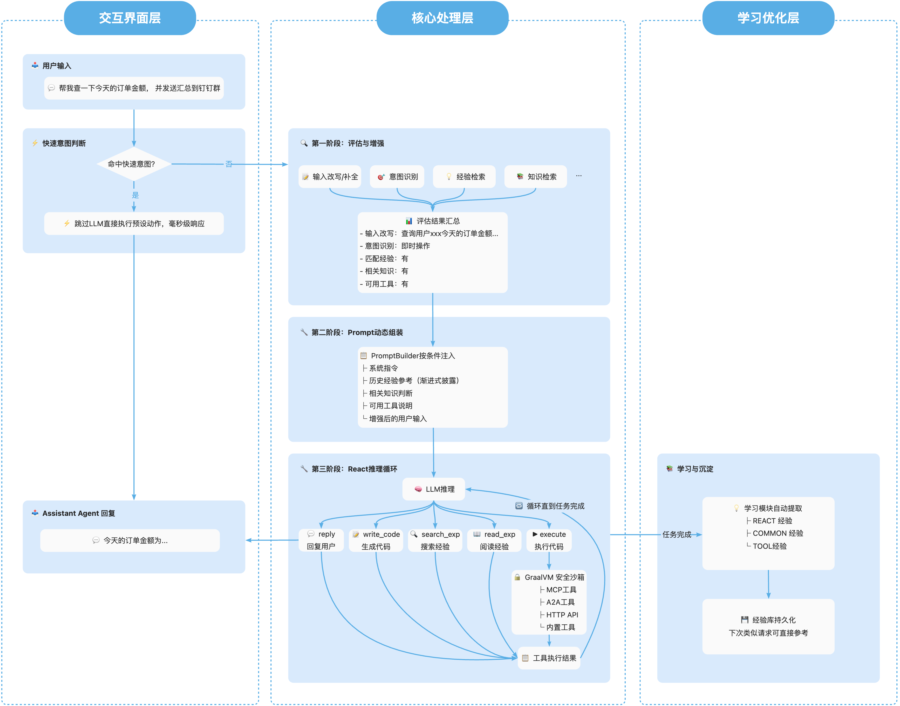

# Assistant Agent

[English](README.md) | [中文](README_zh.md)

[](LICENSE)
[](https://openjdk.org/)
[](https://spring.io/projects/spring-boot)
[](https://spring.io/projects/spring-ai)
[](https://www.graalvm.org/)

## ✨ 技术特性

- 🚀 **代码即行动（Code-as-Action）**：Agent 通过生成并执行代码来完成任务，而非仅仅调用预定义工具，可以在代码中灵活组合多个工具，实现复杂流程
- 🔒 **安全沙箱**：AI 生成的代码在 GraalVM 多语言沙箱中安全运行，具备资源隔离能力
- 📊 **多维评估**：通过评估图（Graph）进行多层次意图识别，精准指导 Agent 行为
- 🔄 **Prompt 动态组装**：根据场景及前置评估结果，动态注入运行时上下文、预取经验候选和稳定指导信息到 Prompt 中，灵活处理不同任务
- 🧠 **统一经验体系**：以统一模型管理 COMMON / REACT / TOOL 三类经验，支持与 Skills 模型互相转化，并通过渐进式披露思想提高经验使用效率与效果
- 🗂️ **管理后台**：通过独立管理模块提供经验检索、CRUD、统计，以及 SKILL 预览 / 导入 / 导出等能力，便于统一维护可复用经验与技能资产
- ⚡ **快速响应**：熟悉场景下，跳过 LLM 推理过程，基于经验快速响应

## 📖 简介

**Assistant Agent** 是一个基于 [Spring AI Alibaba](https://github.com/alibaba/spring-ai-alibaba) 构建的企业级智能助手框架，采用代码即行动（Code-as-Action）范式，通过生成和执行代码来编排工具、完成任务。它是一个**能理解、能行动、能学习**的智能助手解决方案。

### Assistant Agent 能帮你做什么？

Assistant Agent 是一个功能完整的智能助手，具备以下核心能力：

- 🔍 **智能问答**：支持多数据源统一检索架构（通过 SPI 可扩展知识库、Web 等数据源），提供准确、可溯源的答案
- 🛠️ **工具调用**：支持 MCP、HTTP API（OpenAPI）等协议，既可在 React 阶段直接调用工具，也可在生成代码中组合多个工具完成复杂业务流程
- ⏰ **主动服务**：支持定时任务、延迟执行、事件回调，让助手主动为你服务
- 📬 **多渠道触达**：内置 IDE 回复，通过 SPI 可扩展钉钉、飞书、企微、Webhook 等渠道
- 🧩 **运维与经验管理**：支持经验管理、租户维度检索，以及经验模型与 SKILL 包之间的双向转换，方便沉淀并复用业务能力

### 为什么选择 Assistant Agent？

| 价值 | 说明 |
|------|------|
| **降低成本** | 7×24 小时智能客服，大幅减少人工客服成本 |
| **快速接入** | 业务平台通过简单配置即可接入，无需大量开发投入 |
| **灵活定制** | 配置知识库、接入企业工具，打造专属业务助手 |
| **持续优化** | 自动学习积累经验，助手越用越聪明 |

### 适用场景

- **智能客服**：接入企业知识库，智能解答用户咨询
- **运维助手**：对接监控、工单系统，自动处理告警、查询状态、执行操作
- **业务助理**：连接 CRM、ERP 等业务系统，辅助员工完成日常工作

> 💡 以上仅为典型场景示例。通过配置知识库和接入工具，Assistant Agent 可适配更多业务场景，欢迎探索。


### 整体工作原理

以下是 Assistant Agent 处理一个完整请求的端到端流程示例：



### 项目结构

```
AssistantAgent/
├── assistant-agent-common          # 通用工具、枚举、常量
├── assistant-agent-core            # 核心引擎：GraalVM 执行器、工具注册表
├── assistant-agent-extensions      # 扩展模块：
│   ├── dynamic/               #   - 动态工具（MCP、HTTP API）
│   ├── experience/            #   - 统一经验运行时、经验披露与快速意图配置
│   ├── learning/              #   - 学习提取与存储
│   ├── search/                #   - 统一搜索能力
│   ├── reply/                 #   - 多渠道回复
│   ├── trigger/               #   - 触发器机制
│   └── evaluation/            #   - 评估集成
├── assistant-agent-prompt-builder  # Prompt 动态组装
├── assistant-agent-evaluation      # 评估引擎
├── assistant-agent-management      # 经验管理与 SKILL 转换 API
├── assistant-agent-autoconfigure   # Spring Boot 自动配置
└── assistant-agent-start           # 启动模块
```

## 🚀 快速启动

### 前置要求

- Java 17+
- Maven 3.8+
- DashScope API Key

### 1. 克隆并构建

```bash
git clone https://github.com/spring-ai-alibaba/AssistantAgent.git
cd AssistantAgent
mvn clean install -DskipTests
```

### 2. 配置 API Key

```bash
export DASHSCOPE_API_KEY=your-api-key-here
```

### 3. 最小配置

项目已内置默认配置，只需确保 API Key 正确即可。如需自定义，可编辑 `assistant-agent-start/src/main/resources/application.yml`：

```yaml
spring:
  ai:
    dashscope:
      api-key: ${DASHSCOPE_API_KEY}
      chat:
        options:
          model: qwen-max
```

### 4. 启动应用

```bash
cd assistant-agent-start
mvn spring-boot:run
```

所有扩展模块默认开启并采用合理的配置，无需额外配置即可快速启动。

### 5. 配置知识库（接入业务知识）

> 💡 框架默认提供 Mock 知识库实现用于演示测试。**生产环境需要接入真实知识源**（如向量数据库、Elasticsearch、企业知识库 API 等），以便 Agent 能够检索并回答业务相关问题。

#### 方式一：快速体验（使用内置 Mock 实现）

默认配置已启用知识库搜索，可直接体验：

```yaml
spring:
  ai:
    alibaba:
      codeact:
        extension:
          search:
            enabled: true
            knowledge-search-enabled: true  # 默认开启
```

#### 方式二：接入真实知识库（推荐）

实现 `SearchProvider` SPI 接口，接入你的业务知识源：

```java
package com.example.knowledge;

import com.alibaba.assistant.agent.extension.search.spi.SearchProvider;
import com.alibaba.assistant.agent.extension.search.model.*;
import org.springframework.stereotype.Component;
import java.util.*;

@Component  // 添加此注解，Provider 会自动注册
public class MyKnowledgeSearchProvider implements SearchProvider {

    @Override
    public boolean supports(SearchSourceType type) {
        return SearchSourceType.KNOWLEDGE == type;
    }

    @Override
    public List<SearchResultItem> search(SearchRequest request) {
        List<SearchResultItem> results = new ArrayList<>();
        
        // 1. 从你的知识源查询（向量数据库、ES、API 等）
        // 示例：List<Doc> docs = vectorStore.similaritySearch(request.getQuery());
        
        // 2. 转换为 SearchResultItem
        // for (Doc doc : docs) {
        //     SearchResultItem item = new SearchResultItem();
        //     item.setId(doc.getId());
        //     item.setSourceType(SearchSourceType.KNOWLEDGE);
        //     item.setTitle(doc.getTitle());
        //     item.setSnippet(doc.getSummary());
        //     item.setContent(doc.getContent());
        //     item.setScore(doc.getScore());
        //     results.add(item);
        // }
        
        return results;
    }

    @Override
    public String getName() {
        return "MyKnowledgeSearchProvider";
    }
}
```

#### 常见知识源接入示例

| 知识源类型 | 接入方式 |
|-----------|---------|
| **向量数据库**（阿里云 AnalyticDB、Milvus、Pinecone） | 在 `search()` 方法中调用向量相似度检索 API |
| **Elasticsearch** | 使用 ES 客户端执行全文检索或向量检索 |
| **企业知识库 API** | 调用内部知识库 REST API |
| **本地文档** | 读取并索引本地 Markdown/PDF 文件 |

> 📖 更多细节请参考：[知识检索模块文档](assistant-agent-extensions/src/main/java/com/alibaba/assistant/agent/extension/search/README.md)

## 🧩 核心模块

各模块的详细文档请访问 [文档站点](https://java2ai.com/agents/assistantagent/quick-start)。

### 核心模块

| 模块 | 说明 | 文档 |
|------|------|------|
| **评估模块** | 通过评估图（Graph）进行多维度意图识别，支持 LLM 和规则引擎 | [快速开始](https://java2ai.com/agents/assistantagent/features/evaluation/quickstart) ｜ [高级特性](https://java2ai.com/agents/assistantagent/features/evaluation/advanced) |
| **Prompt Builder** | 根据评估结果和运行时上下文动态组装 Prompt | [快速开始](https://java2ai.com/agents/assistantagent/features/prompt-builder/quickstart) ｜ [高级特性](https://java2ai.com/agents/assistantagent/features/prompt-builder/advanced) |

### 工具扩展

| 模块 | 说明 | 文档 |
|------|------|------|
| **MCP 工具** | 接入 Model Context Protocol 服务器，复用 MCP 工具生态 | [快速开始](https://java2ai.com/agents/assistantagent/features/mcp/quickstart) ｜ [高级特性](https://java2ai.com/agents/assistantagent/features/mcp/advanced) |
| **动态 HTTP 工具** | 通过 OpenAPI 规范接入 REST API | [快速开始](https://java2ai.com/agents/assistantagent/features/dynamic-http/quickstart) ｜ [高级特性](https://java2ai.com/agents/assistantagent/features/dynamic-http/advanced) |
| **自定义 CodeAct 工具** | 通过 CodeactTool 接口构建自定义工具 | [快速开始](https://java2ai.com/agents/assistantagent/features/custom-codeact-tool/quickstart) ｜ [高级特性](https://java2ai.com/agents/assistantagent/features/custom-codeact-tool/advanced) |

### 智能能力

| 模块 | 说明 | 文档 |
|------|------|------|
| **经验模块** | 基于统一 COMMON / REACT / TOOL 模型管理经验，支持快速意图、与 Skills 模型互转、渐进式披露，以及通过 `search_exp` / `read_exp` 进行运行时检索 | [快速开始](https://java2ai.com/agents/assistantagent/features/experience/quickstart) ｜ [高级特性](https://java2ai.com/agents/assistantagent/features/experience/advanced) |
| **学习模块** | 从 Agent 执行历史中自动提取有价值的 COMMON / REACT / TOOL 经验 | [快速开始](https://java2ai.com/agents/assistantagent/features/learning/quickstart) ｜ [高级特性](https://java2ai.com/agents/assistantagent/features/learning/advanced) |
| **搜索模块** | 多数据源统一检索引擎，支持知识问答 | [快速开始](https://java2ai.com/agents/assistantagent/features/search/quickstart) ｜ [高级特性](https://java2ai.com/agents/assistantagent/features/search/advanced) |

### 交互能力

| 模块 | 说明 | 文档 |
|------|------|------|
| **回复渠道** | 多渠道消息回复，支持渠道路由 | [快速开始](https://java2ai.com/agents/assistantagent/features/reply/quickstart) ｜ [高级特性](https://java2ai.com/agents/assistantagent/features/reply/advanced) |
| **触发器** | 定时任务、延迟执行、事件回调触发 | [快速开始](https://java2ai.com/agents/assistantagent/features/trigger/quickstart) ｜ [高级特性](https://java2ai.com/agents/assistantagent/features/trigger/advanced) |

### 管理能力

| 能力               | 说明                                         | 入口 |
|------------------|--------------------------------------------|------|
| **经验管理 API**     | 提供面向租户的经验列表、搜索、统计与 CRUD 能力                 | [ExperienceManagementController](assistant-agent-management/src/main/java/com/alibaba/assistant/agent/management/controller/ExperienceManagementController.java) |
| **SKILL 转换 API** | 提供与 SKILL 的转换能力，支撑 Skills 模型与统一经验模型之间的双向转换 | [SkillExchangeController](assistant-agent-management/src/main/java/com/alibaba/assistant/agent/management/controller/SkillExchangeController.java) |

### 更多资源

| 资源 | 链接 |
|------|------|
| 快速开始指南 | [AssistantAgent 快速开始](https://java2ai.com/agents/assistantagent/quick-start) |
| 二次开发指南 | [开发指南](https://java2ai.com/agents/assistantagent/secondary-development) |

---

## 📚 参考文档

- [完整配置参考](assistant-agent-start/src/main/resources/application-reference.yml)
- [Spring AI Alibaba 文档](https://github.com/alibaba/spring-ai-alibaba)

## 🤝 贡献

欢迎贡献！请参阅 [CONTRIBUTING.md](CONTRIBUTING.md) 了解指南。

## 📄 许可证

本项目采用 Apache License 2.0 许可证 - 详见 [LICENSE](LICENSE) 文件。

## 🙏 致谢

- [Spring AI](https://github.com/spring-projects/spring-ai)
- [Spring AI Alibaba](https://github.com/alibaba/spring-ai-alibaba)
- [GraalVM](https://www.graalvm.org/)
